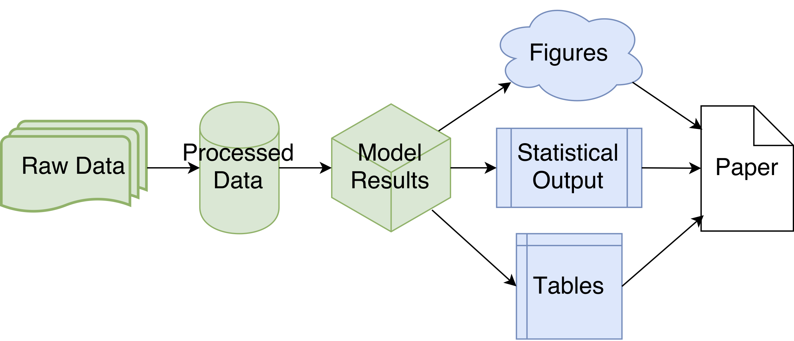
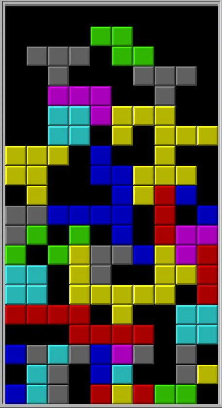

<script async src="https://platform.twitter.com/widgets.js" charset="utf-8"></script>

```{r setup, include=FALSE}
options(htmltools.dir.version = FALSE)
```

# Lesson Objectives

### Week 1 Catchup
### Reproducibility
### Project/File Organization
### Data Processing

---
class: center, middle, inverse

# Week 1 Catchup

---

# GitHub

### What is it?
* An online service to store your Repos.

  - like a shared Dropbox folder that you manually sync to
  
--

* A project management tool.

  - Create / discuss / assign / resolve **issues**
  
  - Manage repos / releases / etc.

--

* A website hosting platform

  - GitHub pages (see https://pages.github.com/ for more details)

---

# GitHub Demo

### Setup access on GitHub

* What is your GitHub account name?

### Check git config

* http://happygitwithr.com/hello-git.html

### Setup ssh key

* http://happygitwithr.com/ssh-keys.html

---

# GitHub workflow

### Update the course repo

* make a new branch
* make changes
* commit changes
* push upstream
* send pull request

---
class: center, middle, inverse

# Reproducibility

---
class: center, middle

# *Your most frequent collaborator is your former self... and that person doesn't respond to emails*

---
class: center

# What does reproducibility mean?

--

--

### Every step of the analysis can be reproduced independently

---

# How do we make our work reproducible?

* Avoid manual data manipulation
  - use scripts to process raw data
  
* Track results and how they were produced
  - version control (e.g. Git)
  - intermediate results
  - summary datasets and code for figures
  - random number seeds (e.g. for some model-fitting algorithms)
  
* Keep documentation close to the underlying code
  - adopt "good"" coding practices

* Make code and data available
  - GitHub, data/code archiving services

---
class: center, middle, inverse

# Project/File Organization

---

# Philosophy

### Make your projects navigable
* find what you need quickly

### Develop good (but flexible) habits
* find out what works for you
* don't be afraid to experiment (version control is your friend!)

### Consistency
* for yourself and for others

---

# General Guidelines

* Include a README for all projects
  - "is this the project I'm looking for?"

* Include a LICENSE for all projects
  - "how can I use this project?"

* Organize sub-folders
  - `data`, `results`, `figures`
  - `doc` (reference material and documentation)
  - `bin` (compiled executables)
  - `paper` (manuscript files)
  
* Pick informative names
  - use alphabetical file sorting to order and group files
  
     (e.g. "yyyy-mm-dd" data formats)

---
class: center, middle, inverse

# Data Processing

---
class: center, middle

<blockquote class="twitter-tweet" data-lang="en"><p lang="en" dir="ltr">I believe what I am accumulating for my data processing pipeline is known as &quot;technical debt&quot; &amp; I need a week to get my sh!it together.</p>&mdash; Katie (@ResourcefulSqrl) <a href="https://twitter.com/ResourcefulSqrl/status/851847867845226500">April 11, 2017</a></blockquote>

---
class: center, middle

<blockquote class="twitter-tweet" data-cards="hidden" data-lang="en"><p lang="en" dir="ltr">&quot;What is technical debt?&quot; Technical debt is hard to explain, but a picture is worth a thousand words. <a href="https://twitter.com/hashtag/programming?src=hash">#programming</a> <a href="https://twitter.com/hashtag/softwaredevelopment?src=hash">#softwaredevelopment</a> <a href="https://t.co/AG2L3VDuKZ">pic.twitter.com/AG2L3VDuKZ</a></p>&mdash; Jedd Ahyoung (@Jedd_Ahyoung) <a href="https://twitter.com/Jedd_Ahyoung/status/826551935822077952">January 31, 2017</a></blockquote>

---
class: center, middle



---
# Philosophy

### Don't modify the raw data!
* use scripts to correct errors (programmatically or manually)

### Avoid duplication of data
* information can become desynchronized
* use data structures / standards for your field

  (or whatever works best for your projects)

### Write functions for each pipeline step

---

# Why write functions?

* Documentation
  - easier to translate into "methods" section

* Debugging & Error-checking
  - verify using known working inputs and outputs
  - simpler to **refactor**

* Reproducibility
  - explicit control over inputs and outputs

* Reusability
  - in R, functions can be collected in packages and shared

---

# Data Formats

### No one-size fits all solution!

### Tidy Data (one generally-applicable standard)

* a dataset is arranged by rows and columns
* each **column** is a variable
  - "A variable contains all values that measure the same underlying attribute (like height, temperature, duration) across units."
* each **row** is an observation
  - "An observation contains all values measured on the same unit (like a person, or a day, or a race) across attributes."

* NOTE: Within a single dataset, **variables** and **observations** may change depending on analysis!

---
class: center, middle

# DEMO

---

# References

* Brian McGill. [Ten commandments for good data management](https://dynamicecology.wordpress.com/2016/08/22/ten-commandments-for-good-data-management/)
* Greg Wilson, Jennifer Bryan, Karen Cranston, Justin Kitzes, Lex Nederbragt, Tracy K. Teal. ["Good Enough Practices in Scientific Computing"](https://arxiv.org/abs/1609.00037)
* Geir Kjetil Sandve, Anton Nekrutenko, James Taylor, Elvind Hovig. ["Ten Simple Rules for Reproducible Computational Research"](http://journals.plos.org/ploscompbiol/article?id=10.1371/journal.pcbi.1003285)
* Hadley Wickham. [Tidy Data](https://www.jstatsoft.org/article/view/v059i10)
* [Tidyr vignette](https://cran.r-project.org/web/packages/tidyr/vignettes/tidy-data.html)

---

class: center, middle

# Acknowledgments

Class supported by:


Slides created via the R package [**xaringan**](https://github.com/yihui/xaringan).