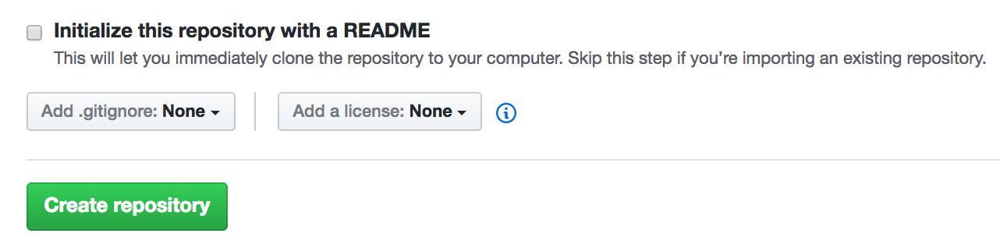
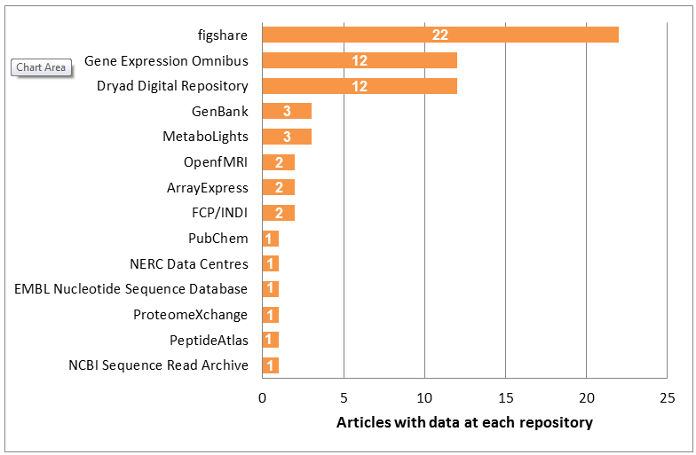
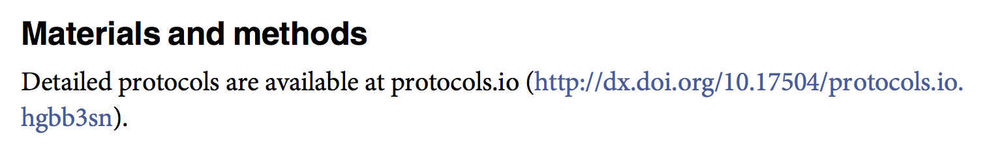
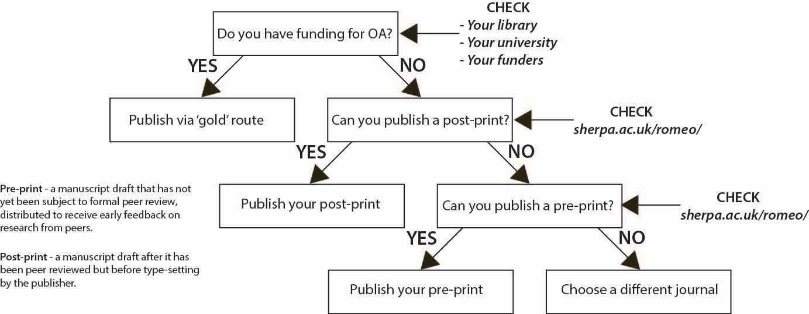

```{r setup, include=FALSE}
options(htmltools.dir.version = FALSE)
```
# Lesson Objectives

### Project Status
### Reusability
* ### Licensing
* ### Data, Code, and Methods Sharing
* ### Preprints

---
class: center, middle, inverse

# Project Status

---

# Project Check-in

### Roadmaps?

--

### Synchronizing Branches on GitHub
* Pull Request -> merge changes across branches

--

* Demo

---

class: center, middle, inverse

# Reusability

---

# How to Maximize Your Research Impacts

### The more citations, the better!

--

### What are the kinds of things that might be citable?

* data
* software
* methods
* papers

--

### Need to specify how other people can use materials

---

class: center, middle

# Licensing

---

# Copyright vs. License

### Copyright

In the United States, certain (most?) creative works are protected by copyright.

* assigned once work is in a fixed form
* creator has rights to sell, copy, distribute, perform, etc.

--

### License

Allows transferral of specific rights from the copyright holder to others.

* by default, "all rights reserved"
* explicit license allows others to use the work

---

# MIT License

### Simple and Permissive

* **Permissions**
  - commercial use
  - distribution
  - modification
  - private use

* **Conditions**
  - accompanied with license and copyright notice
  
* **Limitations**
  - liability
  - warranty

---

# Apache License (2.0)

### Similar to MIT License, but explicit re: patent rights

- contributors give patent rights to users
- users who institute patent litigation using the work have patent rights revoked
- allow companies to contribute to projects without worrying about patent litigation

---

# GPL License (3.0)

### "Copyleft" License

- source code must be included with copies and derivative works
- modifications to the work must be distributed under the same terms
  + if you make additions, those get "absorbed" into the original
  + prevents for-profit companies from taking advantage of open-source work; if they build on top of it, everybody has access to those additions

---

# Creative Commons

### framework for licensing artistic works
- it does not cover source code like the open source licenses

* CC0 -- (essentially) public domain
* CC-BY -- (basic version); copies and derivatives must include attribution
* {NC} clause -- no commerical usage
* {ND} clause -- no derivative works
* {SA} clause -- copies and derivative works must use the same license

---

# Adding a License to a Repo on GitHub

### When creating a new repo



--

### To an existing repo

* Adding a file "license" allows selection of a license template.

---

class: center, middle

# Data, Code, and Methods Sharing

---

# Sharing Platforms

### Persistency
* the material doesn't just disappear if the owner deletes it

### Identifiability
* assign a DOI (digital object identifier) to reference a specific version / copy
* DOIs are unique - will always resolve to the same object

### Other Features
* ease of use
* searching

---

# Data/Code Platforms

### Git Hosting
* GitHub, BitBucket (non-permanent)
* lots of features for collaborating and working, but not suitable for archival

### Archiving
* Figshare, Zenodo (free for individuals)
* Dryad ($120 data publishing charge, up to 20GB)

### Issues
* some journals have data/code publication requirements - specific services may be supported

---

# Increasing Usage


http://blogs.nature.com/scientificdata/2015/03/08/repository-highlight-figshare-and-the-crucial-service-of-generalist-repositories/

---

# protocols.io (methods sharing)

* like GitHub for lab protocols - allows sharing, public/private settings, duplication and modifications, version control
* can assign DOI for citation purposes
* free (basic level)
* smartphone apps to interactively step through protocol in lab
--

### Example
* Chi-Kuang Yao, Yu-Tzu Liu, I-Chi Lee, You-Tung Wang, Ping-Yen Wu. "A Ca2+ channel differentially regulates Clathrin-mediated and activity-dependent bulk endocytosis". *PLOS Biology* April 17, 2017 


---

class: center, middle

# Preprints

---

# Basic Info

### What are "preprints"?

A version of a scientific paper before peer-reviewed publication.

--

### Why 

* Get your scientific results out sooner for use by yourself and others
* Establish precedence before discussing or presenting work in conferences
  - can be listed on CVs, proposals to some funding agencies
* Receive feedback from others before submitting to journals

---

# Pathways to Open Access


http://fossilsandshit.com/a-more-useful-infographic-about-free-legal-easy-open-access/

---

# Issues

### Community Norms
* common in some fields (math, physics, computer science)
* was previously suggested for biomedical research, but [became pubmed instead](https://scholarworks.iu.edu/dspace/bitstream/handle/2022/170/wp01-03B.html)

--

### Challenges
* not all journals allow citations of preprints
* not all journals accept preprints for peer-review

---

# ESA Journals

<blockquote class="twitter-tweet" data-lang="en"><p lang="en" dir="ltr">All ESA journals accept submissions of ms that have previously been posted to a preprint service such as arXiv! A great way to get feedback!</p>&mdash; Scott L Collins (@ESA_Prez2013) <a href="https://twitter.com/ESA_Prez2013/status/243335363693797376">September 5, 2012</a></blockquote>

---

# L&O Letters

<blockquote>**Policy on Submission of Preprints**

L&O-Letters will consider submissions that have previously been made available, either on a preprint server like arXiv, bioRxiv, or PeerJ PrePrints. Any such submissions must, however, not have been published in a scientific journal, book or other venue that could be considered formal publication. Authors must inform the editorial office at submission if their paper has been made available as a preprint, and they must agree to the open-access policy of this journal.</blockquote>
http://aslopubs.onlinelibrary.wiley.com/hub/journal/10.1002/(ISSN)2378-2242/about/author-guidelines.html

--

### L&O currently does not!!
but a letter is being drafted to convince the Editor in Chief otherwise: https://github.com/adsteen/LO_letter

---
# Other Platforms

### Collaborative Writing
* Authorea (https://www.authorea.com/)
* Overleaf (https://www.overleaf.com/)

### Workflow (?) Platforms
* Open Science Framework (https://osf.io/)
  - locally supported by UCSD Libraries
  - Reid Otsuji will give an intro & demo (May 16)
* Stencila (https://stenci.la/)
  - hybrid spreadsheet / R / git (?)
  
---
# References

1. GitHub [Pull Requests](https://help.github.com/articles/about-pull-requests/)
2. US Copyright Office - [Copyright Basics](https://www.copyright.gov/circs/circ01.pdf)
3. [Choosing a license](https://choosealicense.com/)
4. GitHub & Zenodo [tutorial](https://guides.github.com/activities/citable-code/)
5. GitHub & Figshare [tutorial](https://support.figshare.com/support/solutions/articles/6000150264-how-to-connect-figshare-with-your-github-account)
6. [We Need a GitHub for Academic Research](http://www.slate.com/articles/technology/future_tense/2017/04/we_need_a_github_for_academic_research.html)

---

class: center, middle

# Acknowledgments

Class supported by:


Slides created via the R package [**xaringan**](https://github.com/yihui/xaringan).